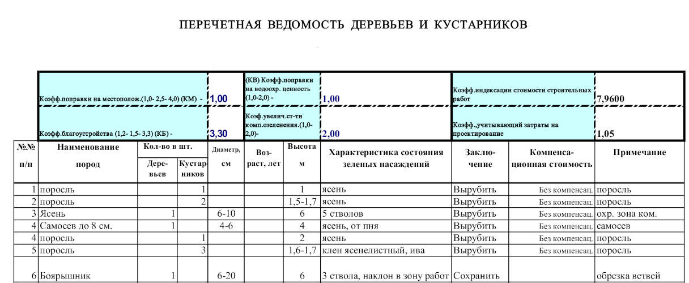
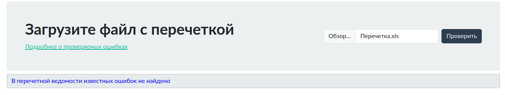

# Что делает проект

Проект автоматизирует поиск ошибок для файлов перечетной ведомости деревьев и кустарников для оформления
заключения или разрешения на вырубку зеленых насаждений города Москвы.
Проект написан на JS. 
Использует библиотеку парсинга BOF файлов xls (xlsx.full.min.js) 
https://cdn.sheetjs.com/
Использует CSS файл bootstrap 5.3
https://getbootstrap.com/
    

    
# Чем полезен проект
Проект будет интересен дендрологам, проектировщикам, строителям
для обнаружения ошибок заполнения перечетной ведомости.

# Как пользователи могут начать работу с проектом

- Скопировать все файлы проекта в одну папку
- Запустить файл perechetka.html

 

# Где пользователи могут получить помощь по данному проекту

Проект находится в разработке. Планируется выпуск описания всех отслеживаемых ошибок 

